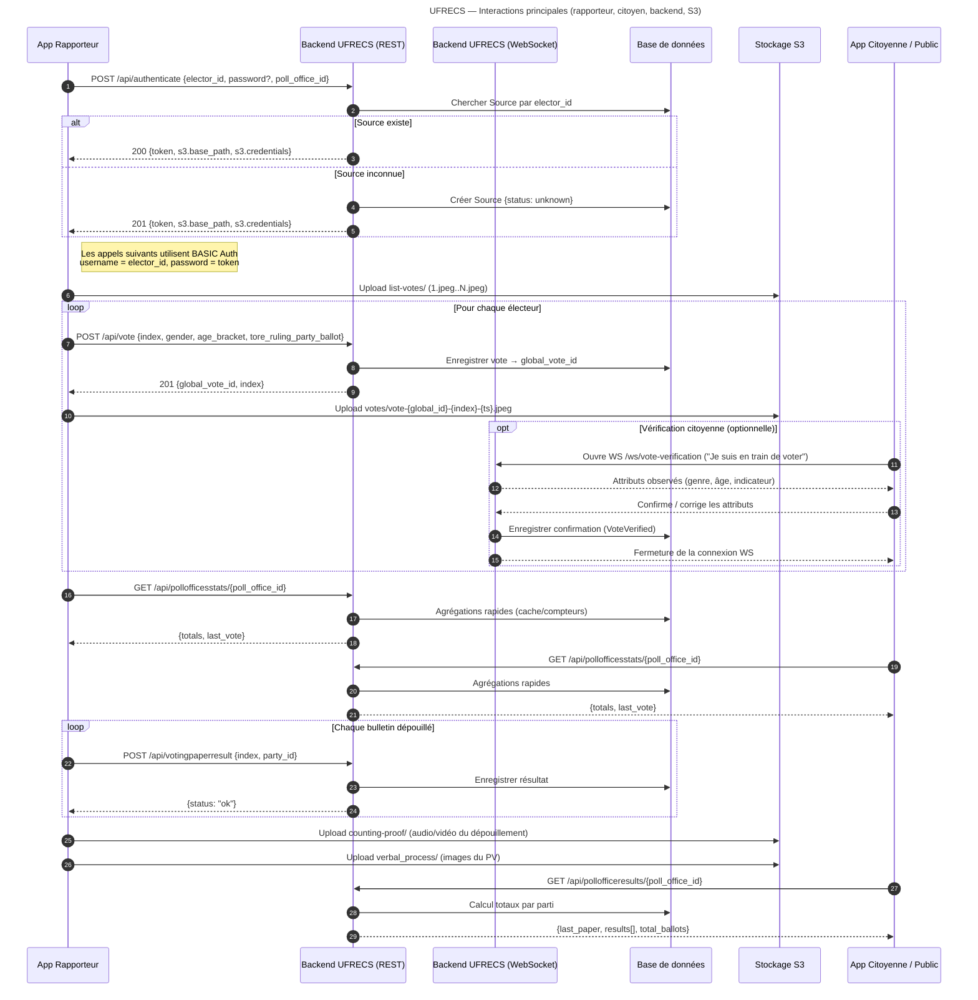

# UFRECS — Vue d’ensemble du backend

UFRECS est un service web qui expose une API REST et un canal WebSocket pour :

* authentifier des **sources** (rapporteurs) ;
* collecter des preuves (images/vidéos/audio) et des événements de vote ;
* publier des **statistiques en temps réel** par bureau de vote ;
* enregistrer et diffuser les **résultats du dépouillement** ;
* permettre une **vérification citoyenne** éphémère via WebSocket.

Le stockage des médias se fait sur S3. Les clients (apps mobile/bot) utilisent **Basic Auth** : `username = elector_id`, `password = token` émis par l’API.

---

## 1) Authentification & provisionning S3

### Endpoint

`POST /api/authenticate/`

### Entrée (JSON)

```json
{
  "elector_id": "string (obligatoire, unique)",
  "password": "string (optionnel)",
  "poll_office_id": "string (obligatoire)"
}
```

### Comportement

* Si `elector_id` existe : génération d’un **token** et association au `poll_office_id`.
* Si `elector_id` n’existe pas : création d’une **Source** avec le statut `unknown/unverified`. Ce statut pourra passer à `independent` après vérification d’identité.
* Retourne des **informations d’upload S3** limitées au périmètre de la source :

  * `s3_base_path` (chemin dédié à la source)
  * **identifiants/certificats temporaires** valables uniquement pour ce chemin (principe du moindre privilège)

### Sortie (JSON)

```json
{
  "token": "string",
  "poll_office_id": "string",
  "s3": {
    "base_path": "s3://bucket/.../source-{elector_id}/",
    "credentials": { "access_key": "...", "secret_key": "...", "session_token": "..." }
  }
}
```

> Remarque : Le **token** est lié au `poll_office_id`. Le client n’a plus à répéter l’ID du bureau de vote dans les appels suivants.

---

## 2) Organisation S3 (médias)

Dans `s3.base_path`, le client crée des sous-dossiers normalisés :

* `list-votes/` : photos des **listes affichées** du bureau (nommage « 1.jpeg », « 2.jpeg », …).
* `counting-proof/` : **audio/vidéo** continues du **dépouillement**.
* `verbal_process/` : images/vidéos du **procès-verbal** final.
* `votes/` : clichés liés à un vote particulier, nommés :
  `vote-{global_id}-{index}-{timestamp}.jpeg`
  (ex. preuve de passage dans l’isoloir, main tenant un bulletin déchiré, etc., toujours sans identification faciale directe).

Cette convention rend inutile la persistance de liens médias en base.

---

## 3) Suivi « jour de vote » (flux temps réel)

### a) Enregistrement d’un passage à l’isoloir

Le rapporteur marque l’entrée et la sortie de l’isoloir, puis envoie un **événement de vote**.

### Endpoint

`POST /api/vote/`

### Entrée (JSON)

```json
{
  "index": 1,                  // énième vote dans le bureau (le client compte 1,2,3…)
  "gender": "male|female",
  "age": "less_30|less_60|more_60",
  "has_torn": true|false
}
```

### Sortie (JSON)

```json
{
  "id": "15446546546",
  "index": 1
}
```

Le client utilise ces identifiants pour nommer et déposer les médias liés au vote.

> Objectif métier : capter le rythme des votes, les répartitions par sexe/tranche d’âge, et un indicateur « bulletin du parti au pouvoir déchiré » lorsque présenté spontanément par l’électeur.

---

## 4) Statistiques de bureau en temps réel

### Endpoint

`GET /api/pollofficesstats/{poll_office_id}/`

### Sortie (JSON)

```json
{
  "totals": {
    "votes": 123,
    "male": 60,
    "female": 62,
    "less_30": 40,
    "less_60": 60,
    "more_60": 18,
    "has_torn": 7
  },
  "last_vote": {
    "index": 123,
    "gender": "female",
    "age": "less_60",
    "has_torn": false,
    "timestamp": "2025-08-15T14:02:11Z"
  }
}
```

> Exigence : endpoint **très optimisé** (le plus sollicité de la journée) pour des tableaux de bord réactifs et des animations en direct.

---

## 5) Dépouillement (après fermeture du vote)

### a) Enregistrement de chaque bulletin dépouillé

`POST /api/votingpaperresult/`

**Entrée**

```json
{ "index": 1, "party_id": "string" }
```

**Sortie**

```json
{ "status": "ok" }
```

### b) Consultation publique des résultats du bureau

`GET /api/pollofficeresults/{poll_office_id}/`

**Sortie**

```json
{
  "last_paper": { "index": 250, "party_id": "ABC" },
  "results": [
    { "party_id": "ABC", "ballots": 120, "share": 0.48 },
    { "party_id": "DEF", "ballots": 100, "share": 0.40 },
    { "party_id": "GHI", "ballots": 30,  "share": 0.12 }
  ],
  "total_ballots": 250
}
```

En parallèle, les clients téléversent dans `counting-proof/` l’**audio/vidéo** du dépouillement, puis des images du **procès-verbal** dans `verbal_process/`.

---

## 6) Vérification citoyenne (WebSocket)

### Canal

`WS /ws/vote-verification`

### Principe

1. L’électeur ouvre la WebSocket depuis son app en entrant dans l’isoloir (« Je suis en train de voter »).
2. Dès qu’un rapporteur publie le vote correspondant, l’app **reçoit** via WS les attributs déclarés (genre, tranche d’âge, drapeau « bulletin déchiré »).
3. L’électeur **confirme ou corrige** ces attributs dans l’app.
4. Le backend enregistre la confirmation dans la table **`VoteVerified`** (liée à l’électeur et au vote) pour **renforcer la crédibilité** des observations.
5. Le backend **ferme la WS** et l’app revient au flux standard.

> La fiabilité repose sur la **pluralité des rapporteurs** et la **concordance** entre leurs rapports et les confirmations citoyennes.

---

## 7) Modèle « Source » & états

* **Source = rapporteur** (ou « source opportuniste » lorsqu’aucun rapporteur officiel n’est présent).
* À la première authentification inconnue : état `unknown/unverified` (permet de ne pas bloquer, tout en filtrant ensuite).
* Après vérification d’identité : état `independent`.
  Ces statuts orientent l’exploitation/publication des données.

---

## 8) Exigences pour un backend « valide »

Un backend UFRECS peut être implémenté dans la technologie de votre choix, **à condition** de respecter le contrat d’API ci-dessus et de fournir :

* **Documentation** : dossier `docs/` ou `documentation/`.
* **Scripts développeur** :

  * `setup-dev-mode.sh` : installe **toutes** les dépendances et prépare l’environnement local.
  * `run-dev-mode` : lance le serveur en mode dev.
* **Script de déploiement** :

  * `install-home-prod` : provisionne la prod de bout en bout (dépendances, configuration serveur, Nginx, etc.).
* **Tests** :

  * `run-test` : exécute l’ensemble des tests backend.

Objectifs : **documenté**, **testé**, **installable rapidement**, **remplaçable** (on peut changer de backend tant que l’API est respectée).

---

## 9) Récapitulatif des endpoints

| Cas d’usage                                  | Méthode & chemin                               | Corps/Paramètres                                             | Réponse                                        |
| -------------------------------------------- | ---------------------------------------------- | ------------------------------------------------------------ | ---------------------------------------------- |
| Authentifier une source & fournir l’accès S3 | `POST /api/authenticate/`                      | `elector_id`, `password?`, `poll_office_id`                  | `token`, `s3.base_path`, `s3.credentials`      |
| Enregistrer un vote (jour J)                 | `POST /api/vote/`                              | `index`, `gender`, `age`, `has_torn` | `id`, `index`                      |
| Stats temps réel d’un bureau                 | `GET /api/pollofficesstats/{poll_office_id}/`  | —                                                            | `totals`, `last_vote`                          |
| Enregistrer un bulletin dépouillé            | `POST /api/votingpaperresult/`                 | `index`, `party_id`                                          | `{ "status": "ok" }`                           |
| Résultats cumulés d’un bureau                | `GET /api/pollofficeresults/{poll_office_id}/` | —                                                            | `last_paper`, `results[]`, `total_ballots`     |
| Vérification citoyenne                       | `WS /ws/vote-verification`                     | ouverture WS côté citoyen                                    | confirmations -> enregistrement `VoteVerified` |

---

## 10) Bonnes pratiques & garde-fous

* **Vie privée** : prises de vue **de dos** et cadrage mains/objet ; proscrire l’identification faciale.
* **Sécurité** : jetons courts/rotatifs ; accès S3 **scopé par chemin** ; journaux d’audit.
* **Résilience** : clients **idempotents** (réémission sûre), files d’attente/retry côté backend sur les chemins critiques.
* **Performance** : `GET /api/pollofficesstats/` doit être **très rapide** (cache/agrégats).

---

## 11) Diagramme


